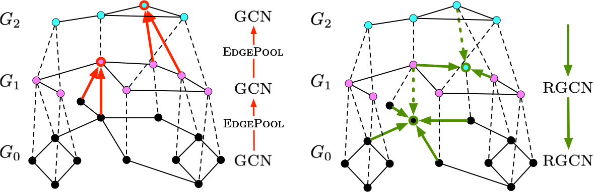

# Hierarchical Graph Net

[](https://arxiv.org/abs/2107.07432)



Graph neural networks (GNNs) based on message passing between neighboring nodes are known to be insufficient for capturing long-range interactions in graphs.
In this project we study hierarchical message passing models that leverage a multi-resolution representation of a given graph. This facilitates learning of features that span large receptive fields without loss of local information, an aspect not studied in preceding work on hierarchical GNNs. 
We introduce Hierarchical Graph Net (HGNet), which for any two connected nodes guarantees existence of message-passing paths of at most logarithmic length w.r.t. the input graph size. Yet, under mild assumptions, its internal hierarchy maintains asymptotic size equivalent to that of the input graph. We observe that our HGNet outperforms conventional stacking of GCN layers particularly in molecular property prediction benchmarks. Finally, we propose two benchmarking tasks designed to elucidate capability of GNNs to leverage long-range interactions in graphs.

## Dependencies

Create a Python3 venv with:
* python>=3.7
* [PyTorch](http://pytorch.org/)>=1.7
* [PyTorch Geometric](https://github.com/rusty1s/pytorch_geometric)>=1.6.3
* numpy
* sklearn
* tqdm
* [TensorBoard](https://www.tensorflow.org/tensorboard)>=2.3


## Training

The datasets will be automatically downloaded via PyTorch Geometric (or generated) to `data/`.

For datasets that do not provide standardized train/validation/test splits, data split from `splits/` will be used for cross-validation.

Model hyperparameters for each dataset are loaded from config files in `configs/`, but can be over-ridden by command-line arguments.

To train default GNN architecture on default dataset (without Tensorboard logging) simply run:
```bash
python main.py --no_tensorboard
```

To specify the GNN model and dataset (with Tensorboard logging) use cmd-line args, e.g.:
```bash
python main.py --dataset=Cora --model=HGNet --depth=1
```

Progression of training & validation statistics can be viewed in TensorBoard, e.g.:
```bash
tensorboard --logdir logs/run_20210608T052342
```


## Datasets
[Download all datasets generated in this work from Google Drive](https://drive.google.com/file/d/19BTfz3f9lpOa8CtTazubbd2MN6HhwY7q) (approx. 145MB ZIP, 3.15GB unpacked) 

### Color-connectivty task
We introduce synthetic graph classification datasets with the task of recognizing the connectivity of same-colored nodes in 4 graphs of varying topology.
* The four Color-connectivity datasets were created by taking a graph and randomly coloring half of its nodes one color, e.g., red, and the other nodes blue, such that the red nodes either form a single connected island or two disjoint islands.
  The binary classification task is then distinguishing between these two cases.
  The node colorings were sampled by running two red-coloring random walks starting from two random nodes.
* For the underlying graph topology we used: 1) 16x16 2D grid, 2) 32x32 2D grid, 3) Euroroad road network (Šubelj et al. 2011), and 4) Minnesota road network.
* We sampled a balanced set of 15,000 coloring examples for each graph, except for Minnesota network for which we generated 6,000 examples due to memory constraints.
* The Color-connectivity task requires combination of local and long-range graph information processing to which most existing message-passing Graph Neural Networks (GNNs) do not scale.
  These datasets can serve as a common-sense validation for new and more powerful GNN methods.
  These testbed datasets can still be improved, as the node features are minimal (only a binary color) and recognition of particular topological patterns (e.g., rings or other subgraphs) is not needed to solve the task.

### Citation networks with k-hop sanitized dataset splits
In an effort to make prediction tasks of CiteSeer, Cora
and PubMed citation networks more suitable for testing the
models’ ability to utilize information from farther nodes, we
experimented with a specific resampling of their training, validation and test splits:
* The standard semi-supervised splits follow the same key for each
  dataset: 20 examples from each class are randomly selected for training, while 500 and 1000
  examples are drawn uniformly randomly for the validation and test splits.
* We used principally the same key, but a different random sampling strategy.
  Once a node is drawn, we enforced that none of its k-th degree neighbors is selected for any split. 
  This approach guarantees that a k-hop neighborhood of each labeled node is “sanitized” of labels. 
* As such, we prevent potential correct-class label imprinting in the representation 
  of these k-th degree neighbors during the semi-supervised transductive training.
* For a model to leverage such imprinting benefit of homophily, it has to be able to reach beyond this 
  k-hop neighborhood, assuming that the class homophily spans that far in the underlying data.


## Citation

If you find this work useful, please consider citing:
```
@misc{rampasek2021hgnet,
      title={Hierarchical graph neural nets can capture long-range interactions}, 
      author={Ladislav Ramp\'{a}\v{s}ek and Guy Wolf},
      year={2021},
      eprint={2107.07432},
      archivePrefix={arXiv},
      primaryClass={cs.LG}
}
```